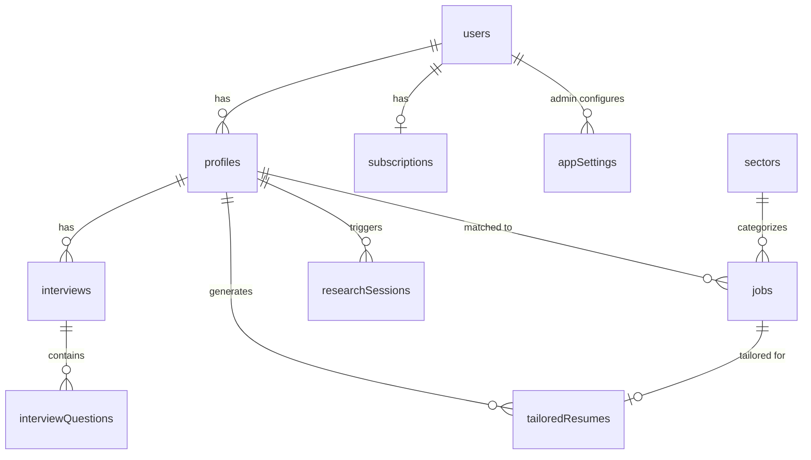

# Architecture

This document describes the system architecture of CareerSync AI — how the frontend, backend, database, and AI services work together.

---

## High-Level Architecture

```
┌─────────────────────────────────────────────────────────────────┐
│                         Client (Browser)                         │
│  ┌─────────────┐  ┌─────────────┐  ┌─────────────┐  ┌────────┐ │
│  │  React 19   │  │  tRPC Client│  │ React Query │  │ Framer │ │
│  │  + Vite     │  │  + SuperJSON│  │  (Cache)    │  │ Motion │ │
│  └──────┬──────┘  └──────┬──────┘  └──────┬──────┘  └────────┘ │
│         │                │                │                     │
│         └────────────────┴────────────────┘                     │
│                          │                                       │
│                    HTTP /api/trpc/*                               │
└──────────────────────────┬───────────────────────────────────────┘
                           │
┌──────────────────────────┼───────────────────────────────────────┐
│                    Server (Node.js)                                │
│  ┌───────────────────────┴─────────────────────────────────────┐  │
│  │                      Hono Framework                          │  │
│  │  ┌────────────┐  ┌────────────┐  ┌──────────────────────┐  │  │
│  │  │   CORS     │  │ Body Limit │  │  Request Logging     │  │  │
│  │  │ Middleware │  │ (50MB)     │  │  Middleware          │  │  │
│  │  └─────┬──────┘  └─────┬──────┘  └──────────┬───────────┘  │  │
│  │        └───────────────┴──────────────────────┘              │  │
│  │                          │                                   │  │
│  │  ┌─────────────────────────────────────────────────────────┐  │  │
│  │  │              tRPC Router (10 Domain Routers)             │  │  │
│  │  │  auth · profile · interview · job · resume · research  │  │  │
│  │  │  sector · subscription · settings · admin               │  │  │
│  │  └─────────────────────────────────────────────────────────┘  │  │
│  │                          │                                   │  │
│  │  ┌───────────────────────┴───────────────────────────────┐ │  │
│  │  │              Middleware (public / authed / admin)        │ │  │
│  │  └─────────────────────────────────────────────────────────┘ │  │
│  └─────────────────────────────────────────────────────────────┘  │
│                           │                                       │
│                    ┌──────┴──────┐                                │
│                    │  Drizzle ORM  │                                │
│                    └──────┬──────┘                                │
│                           │                                       │
│              ┌────────────┴────────────┐                          │
│              │      PostgreSQL         │                          │
│              │   (Supabase / Local)    │                          │
│              └─────────────────────────┘                          │
└───────────────────────────────────────────────────────────────────┘
```

---

## Frontend Architecture

### Build System

- **Vite** handles dev server, HMR, and production builds
- `@hono/vite-dev-server` integrates the Hono backend during development
- Frontend builds to `dist/public/`
- Backend bundles via `esbuild` to `dist/boot.js`

### State Management

| Layer | Technology | Purpose |
|-------|-----------|---------|
| Server State | tRPC + React Query | API data, caching, mutations |
| Client State | React hooks | Local UI state (forms, modals, selections) |
| Auth State | `useAuth` hook | Current user, login/logout |

### Key Patterns

- **tRPC Client**: `src/lib/trpc.tsx` — creates typed client with `httpBatchLink`
- **Query Client**: `src/lib/trpc.tsx` — TanStack Query client with default config
- **Auth Hook**: `src/hooks/useAuth.ts` — wraps `trpc.auth.me`, handles redirects

### Component Hierarchy

```
App.tsx
├── Layout.tsx (Navbar + Footer + Lenis smooth scroll)
│   ├── Routes (src/App.tsx)
│   │   ├── Home.tsx (landing page)
│   │   ├── UploadPage.tsx
│   │   ├── InterviewPage.tsx
│   │   ├── ResearchPage.tsx
│   │   ├── DashboardPage.tsx
│   │   ├── ResumesPage.tsx
│   │   ├── DatasheetPage.tsx
│   │   ├── Login.tsx / SignupPage.tsx / RegisterPage.tsx
│   │   ├── AccountPage.tsx
│   │   ├── DemoPage.tsx + Demo*Pages
│   │   └── AdminLayout.tsx
│   │       ├── AdminDashboardPage.tsx
│   │       ├── AdminUsersPage.tsx
│   │       ├── AdminSubscriptionsPage.tsx
│   │       └── AdminSettingsPage.tsx
```

---

## Backend Architecture

### Hono Application (`api/boot.ts`)

1. **CORS Middleware** — allows all origins in dev
2. **Body Limit** — 50MB max request size
3. **Request Logging** — method, URL, duration, status
4. **Health Check** — `/api/health`
5. **tRPC Handler** — `/api/trpc/*` delegates to tRPC router
6. **Static Files** — serves `dist/public/` in production

### tRPC Router Aggregation (`api/router.ts`)

```ts
export const appRouter = createRouter({
  ping: publicQuery.query(() => ({ ok: true })),
  auth: authRouter,
  profile: profileRouter,
  interview: interviewRouter,
  job: jobRouter,
  resume: resumeRouter,
  research: researchRouter,
  sector: sectorRouter,
  subscription: subscriptionRouter,
  settings: settingsRouter,
  admin: adminRouter,
});
```

### Middleware Stack (`api/middleware.ts`)

```ts
publicQuery    → no auth
authedQuery    → publicQuery + requireAuth (valid JWT cookie)
adminQuery     → authedQuery + requireRole("admin")
```

### Context (`api/context.ts`)

```ts
type TrpcContext = {
  req: Request;
  resHeaders: Headers;
  user?: User;  // populated by authenticateRequest()
};
```

---

## Database Architecture

### Tables (10 total)

| Table | Purpose | Key Relations |
|-------|---------|---------------|
| `users` | Authentication & roles | — |
| `profiles` | Candidate profile (resume + interview) | `userId` → users |
| `interviews` | Interview session state | `profileId` → profiles |
| `interviewQuestions` | Q&A pairs | `interviewId` → interviews |
| `sectors` | Economic sectors (8 default) | — |
| `jobs` | Discovered job opportunities | `profileId` → profiles, `sectorId` → sectors |
| `tailoredResumes` | Generated resume per job | `jobId` → jobs, `profileId` → profiles |
| `researchSessions` | Research agent progress | `profileId` → profiles |
| `subscriptions` | Billing & plans | `userId` → users |
| `appSettings` | Runtime configuration | — |

### Enums

- `user_role`: `user` | `admin`
- `profile_status`: `uploaded` | `interviewing` | `completed`
- `interview_status`: `in_progress` | `completed`
- `job_status`: `discovered` | `shortlisted` | `applied` | `archived`
- `research_session_status`: `running` | `completed` | `failed`
- `subscription_status`: `active` | `canceled` | `past_due` | `inactive`
- `subscription_interval`: `month` | `year`

### Entity Relationship Diagram



---

## Data Flow: The 5-Step Journey

### Step 1: Resume Upload

```
User uploads PDF/DOCX
  → Client-side text extraction (pdfjs-dist, mammoth)
  → extractProfileFromText() parses structured data
  → trpc.profile.create mutation
  → Saved to profiles table
  → Navigate to /interview
```

### Step 2: AI Interview

```
User answers 8 questions
  → trpc.interview.create (new session)
  → trpc.interview.addQuestion (8x)
  → trpc.interview.answerQuestion (saves answers)
  → Live profile sidebar builds from answers state
  → On completion: trpc.interview.complete
  → trpc.profile.update (aggregates answers)
  → Navigate to /research
```

### Step 3: Research Agents

```
User clicks "Start Research"
  → trpc.research.create (new session)
  → Client-side simulation runs (8 sectors sequentially)
  → generateMockJobsForSector() creates mock jobs
  → trpc.job.createMany (saves all to DB)
  → trpc.research.updateProgress / complete
  → Navigate to /dashboard
```

### Step 4: Results Dashboard

```
User views /dashboard
  → trpc.job.getByProfile (fetches jobs)
  → trpc.job.stats (aggregates counts)
  → Client-side filtering, sorting, search
  → trpc.job.updateStatus (track application progress)
```

### Step 5: Tailored Resumes

```
User views /resumes
  → trpc.resume.getByProfile (fetches tailored resumes)
  → trpc.job.getByProfile (for job metadata)
  → Client-side generates HTML resumes
  → Download as HTML or ZIP
```

---

## Auth System Design

### JWT Session Flow

```
Login
  → bcrypt.compare(password, passwordHash)
  → signSessionToken({ userId, email, sessionVersion })
  → Set HTTP-only cookie "kimi_sid" (1 year)
  → Subsequent requests: verifySessionToken() → authenticateRequest()

Logout
  → Clear cookie (maxAge: 0)
  → Invalidate all queries
```

### Role-Based Access Control

| Role | Access |
|------|--------|
| `user` | Own profile, jobs, resumes, subscription |
| `admin` | All of above + admin dashboard, user management, settings |

Admin assignment: `ADMIN_EMAILS` env var or manual role update via admin panel.

---

## File Organization

```
├── api/                    # Backend — all server code
│   ├── auth/               # JWT session utilities
│   ├── lib/                # Email, env, cookies, HTTP client
│   ├── queries/            # DB query helpers
│   ├── boot.ts             # Hono entry point
│   ├── router.ts           # tRPC router aggregation
│   ├── middleware.ts       # Auth middleware
│   ├── context.ts          # tRPC context builder
│   └── *-router.ts         # Domain routers (10 files)
├── src/                    # Frontend — all client code
│   ├── components/
│   │   ├── ui/             # 50+ shadcn/ui components
│   │   ├── research/       # AgentCanvas, ActivityLog
│   │   └── resume/         # ResumeCard, ResumePreviewModal
│   ├── pages/              # 25+ route pages
│   ├── hooks/              # useAuth, use-mobile
│   ├── lib/                # trpc client, utils, mock data
│   └── providers/          # TRPCProvider
├── db/                     # Database schema & migrations
│   ├── schema.ts           # Drizzle table definitions
│   └── migrations/         # Generated SQL
├── contracts/              # Shared types & constants
│   ├── types.ts            # Re-exports from db/schema
│   ├── constants.ts          # Session config, error messages
│   └── errors.ts           # Error factory
├── docs/                   # Documentation
├── public/                 # Static assets (images, fonts)
└── dist/                   # Build output
```

---

## Key Design Decisions

1. **Monorepo-ish structure** — Frontend and backend share `contracts/` and `db/` for type safety
2. **tRPC over REST** — End-to-end type safety without manual API documentation
3. **Drizzle ORM** — Type-safe SQL with minimal abstraction overhead
4. **Mock data for demo** — Research agents and job data are simulated; designed to be replaced with real APIs
5. **Client-side resume parsing** — PDF/DOCX text extraction happens in browser to reduce server load
6. **HTTP-only cookies** — JWT sessions are secure by default (no XSS token theft)
