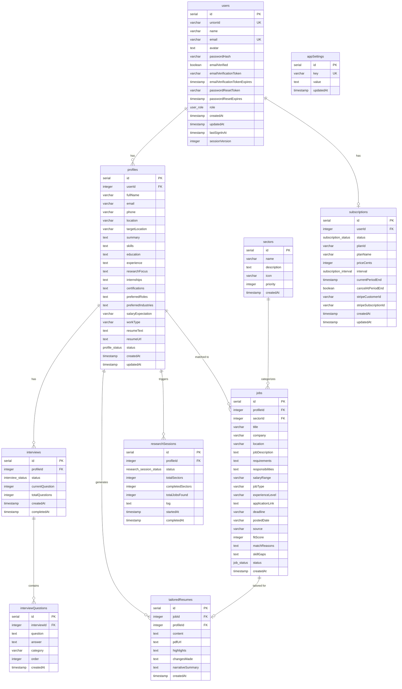

# Database Reference

Complete reference for the CareerSync AI PostgreSQL database schema, managed by Drizzle ORM.

---

## Schema Overview

The database consists of **10 tables** and **7 enums**, supporting the full job-matching pipeline from user authentication to tailored resume generation.

---

## Enums

| Enum Name | Values |
|-----------|--------|
| `user_role` | `user`, `admin` |
| `profile_status` | `uploaded`, `interviewing`, `completed` |
| `interview_status` | `in_progress`, `completed` |
| `job_status` | `discovered`, `shortlisted`, `applied`, `archived` |
| `research_session_status` | `running`, `completed`, `failed` |
| `subscription_status` | `active`, `canceled`, `past_due`, `inactive` |
| `subscription_interval` | `month`, `year` |

---

## Tables

### `users`

Authentication and user management.

| Column | Type | Constraints | Description |
|--------|------|-------------|-------------|
| `id` | `serial` | PK | Auto-increment primary key |
| `unionId` | `varchar(255)` | Unique | External auth ID (optional) |
| `name` | `varchar(255)` | — | Display name |
| `email` | `varchar(320)` | Not null, Unique | Login email |
| `avatar` | `text` | — | Avatar URL |
| `passwordHash` | `varchar(255)` | — | bcrypt hash |
| `emailVerified` | `boolean` | Default: false | Verification status |
| `emailVerificationToken` | `varchar(255)` | — | Verification token |
| `emailVerificationTokenExpires` | `timestamp` | — | Token expiry |
| `passwordResetToken` | `varchar(255)` | — | Reset token |
| `passwordResetExpires` | `timestamp` | — | Reset expiry |
| `role` | `user_role` | Default: "user" | RBAC role |
| `createdAt` | `timestamp` | Default: now | Registration time |
| `updatedAt` | `timestamp` | Default: now, On update | Last update |
| `lastSignInAt` | `timestamp` | Default: now | Last login |
| `sessionVersion` | `integer` | Default: 0 | For session invalidation |

**TypeScript**: `User`, `InsertUser`

---

### `profiles`

Candidate profile extracted from resume + interview answers.

| Column | Type | Constraints | Description |
|--------|------|-------------|-------------|
| `id` | `serial` | PK | Auto-increment |
| `userId` | `integer` | Not null | FK → users.id |
| `fullName` | `varchar(255)` | — | Parsed from resume |
| `email` | `varchar(320)` | — | Contact email |
| `phone` | `varchar(50)` | — | Phone number |
| `location` | `varchar(255)` | — | Current location |
| `targetLocation` | `varchar(255)` | — | Desired work location |
| `summary` | `text` | — | Career summary |
| `skills` | `text` | — | Comma-separated skills |
| `education` | `text` | — | Education history |
| `experience` | `text` | — | Work experience |
| `researchFocus` | `text` | — | Research interests |
| `internships` | `text` | — | Internship history |
| `certifications` | `text` | — | Certifications |
| `preferredRoles` | `text` | — | Target roles (comma-separated) |
| `preferredIndustries` | `text` | — | Preferred sectors |
| `salaryExpectation` | `varchar(100)` | — | Salary range |
| `workType` | `varchar(50)` | — | Environment preference |
| `resumeText` | `text` | — | Full extracted resume text |
| `resumeUrl` | `text` | — | Original filename |
| `status` | `profile_status` | Default: "uploaded" | Pipeline progress |
| `createdAt` | `timestamp` | Default: now | Creation time |
| `updatedAt` | `timestamp` | Default: now, On update | Last update |

**TypeScript**: `Profile`, `InsertProfile`

---

### `interviews`

Interview session tracking.

| Column | Type | Constraints | Description |
|--------|------|-------------|-------------|
| `id` | `serial` | PK | Auto-increment |
| `profileId` | `integer` | Not null | FK → profiles.id |
| `status` | `interview_status` | Default: "in_progress" | Session state |
| `currentQuestion` | `integer` | Default: 0 | Progress index |
| `totalQuestions` | `integer` | Default: 8 | Total questions |
| `createdAt` | `timestamp` | Default: now | Start time |
| `completedAt` | `timestamp` | — | Completion time |

**TypeScript**: `Interview`, `InsertInterview`

---

### `interviewQuestions`

Individual Q&A pairs within an interview.

| Column | Type | Constraints | Description |
|--------|------|-------------|-------------|
| `id` | `serial` | PK | Auto-increment |
| `interviewId` | `integer` | Not null | FK → interviews.id |
| `question` | `text` | Not null | Question text |
| `answer` | `text` | — | User's answer |
| `category` | `varchar(100)` | — | Question category |
| `order` | `integer` | Not null | Display order |
| `createdAt` | `timestamp` | Default: now | Creation time |

**TypeScript**: `InterviewQuestion`, `InsertInterviewQuestion`

---

### `sectors`

Economic sectors for job categorization.

| Column | Type | Constraints | Description |
|--------|------|-------------|-------------|
| `id` | `serial` | PK | Auto-increment |
| `name` | `varchar(100)` | Not null | Sector name |
| `description` | `text` | — | Sector description |
| `icon` | `varchar(50)` | — | Lucide icon name |
| `priority` | `integer` | Default: 0 | Display order |
| `createdAt` | `timestamp` | Default: now | Creation time |

**Default Sectors**: Technology, Healthcare, Finance, Energy, Education, Manufacturing, Consulting, Government

**TypeScript**: `Sector`, `InsertSector`

---

### `jobs`

Discovered job opportunities.

| Column | Type | Constraints | Description |
|--------|------|-------------|-------------|
| `id` | `serial` | PK | Auto-increment |
| `profileId` | `integer` | Not null | FK → profiles.id |
| `sectorId` | `integer` | — | FK → sectors.id |
| `title` | `varchar(255)` | Not null | Job title |
| `company` | `varchar(255)` | Not null | Company name |
| `location` | `varchar(255)` | — | Job location |
| `jobDescription` | `text` | — | Full description |
| `requirements` | `text` | — | Required skills |
| `responsibilities` | `text` | — | Role responsibilities |
| `salaryRange` | `varchar(255)` | — | Compensation range |
| `jobType` | `varchar(50)` | — | Full-time, contract, etc. |
| `experienceLevel` | `varchar(50)` | — | Entry, Mid, Senior |
| `applicationLink` | `text` | — | Direct apply URL |
| `deadline` | `varchar(100)` | — | Application deadline |
| `postedDate` | `varchar(100)` | — | Posting date |
| `source` | `varchar(255)` | — | Job board source |
| `fitScore` | `integer` | Default: 0 | Match score 0-100 |
| `matchReasons` | `text` | — | Why this matches |
| `skillGaps` | `text` | — | Missing skills |
| `status` | `job_status` | Default: "discovered" | Tracking status |
| `createdAt` | `timestamp` | Default: now | Discovery time |

**TypeScript**: `Job`, `InsertJob`

---

### `tailoredResumes`

AI-generated resumes tailored to specific jobs.

| Column | Type | Constraints | Description |
|--------|------|-------------|-------------|
| `id` | `serial` | PK | Auto-increment |
| `jobId` | `integer` | Not null | FK → jobs.id |
| `profileId` | `integer` | Not null | FK → profiles.id |
| `content` | `text` | Not null | Full resume text |
| `pdfUrl` | `text` | — | Generated PDF URL |
| `highlights` | `text` | — | Key changes (JSON) |
| `changesMade` | `text` | — | Detailed modifications (JSON) |
| `narrativeSummary` | `text` | — | Human-readable summary |
| `createdAt` | `timestamp` | Default: now | Generation time |

**TypeScript**: `TailoredResume`, `InsertTailoredResume`

---

### `researchSessions`

Research agent progress tracking.

| Column | Type | Constraints | Description |
|--------|------|-------------|-------------|
| `id` | `serial` | PK | Auto-increment |
| `profileId` | `integer` | Not null | FK → profiles.id |
| `status` | `research_session_status` | Default: "running" | Session state |
| `totalSectors` | `integer` | Default: 0 | Sectors to search |
| `completedSectors` | `integer` | Default: 0 | Completed count |
| `totalJobsFound` | `integer` | Default: 0 | Jobs discovered |
| `log` | `text` | — | Activity log |
| `startedAt` | `timestamp` | Default: now | Start time |
| `completedAt` | `timestamp` | — | Completion time |

---

### `subscriptions`

User billing and plan subscriptions.

| Column | Type | Constraints | Description |
|--------|------|-------------|-------------|
| `id` | `serial` | PK | Auto-increment |
| `userId` | `integer` | Not null, Unique | FK → users.id |
| `status` | `subscription_status` | Default: "inactive" | Billing status |
| `planId` | `varchar(100)` | — | Plan identifier |
| `planName` | `varchar(255)` | — | Display name |
| `priceCents` | `integer` | — | Price in cents |
| `interval` | `subscription_interval` | — | month/year |
| `currentPeriodEnd` | `timestamp` | — | Renewal date |
| `cancelAtPeriodEnd` | `boolean` | Default: false | Cancellation flag |
| `stripeCustomerId` | `varchar(255)` | — | Stripe customer ID |
| `stripeSubscriptionId` | `varchar(255)` | — | Stripe subscription ID |
| `createdAt` | `timestamp` | Default: now | Creation time |
| `updatedAt` | `timestamp` | Default: now, On update | Last update |

**TypeScript**: `Subscription`, `InsertSubscription`

---

### `appSettings`

Runtime application configuration (admin-editable).

| Column | Type | Constraints | Description |
|--------|------|-------------|-------------|
| `id` | `serial` | PK | Auto-increment |
| `key` | `varchar(255)` | Not null, Unique | Setting name |
| `value` | `text` | — | Setting value |
| `updatedAt` | `timestamp` | Default: now, On update | Last update |

**TypeScript**: `AppSetting`, `InsertAppSetting`

**Default Keys**: `moonshot_api_key`, `stripe_publishable_key`, `stripe_secret_key`, `default_plan_id`

---

## Entity Relationship Diagram



---

## Query Patterns

### Basic CRUD with Drizzle

```ts
import { getDb } from "@/api/queries/connection";
import { profiles, jobs } from "@db/schema";
import { eq, desc, and, gte } from "drizzle-orm";

// Select one
const result = await db.select().from(profiles).where(eq(profiles.id, 1)).limit(1);

// Select with order
const allJobs = await db.select().from(jobs).orderBy(desc(jobs.fitScore));

// Insert
const [{ id }] = await db.insert(profiles).values({ userId: 1, fullName: "John" }).returning({ id: profiles.id });

// Update
await db.update(profiles).set({ status: "completed" }).where(eq(profiles.id, 1));

// Delete
await db.delete(jobs).where(eq(jobs.profileId, 1));

// Filter with AND
const filtered = await db.select().from(jobs)
  .where(and(eq(jobs.profileId, 1), gte(jobs.fitScore, 80)));
```

### Aggregation

```ts
import { count, avg } from "drizzle-orm";

const [userCount] = await db.select({ count: count() }).from(users);
const [avgScore] = await db.select({ avg: avg(jobs.fitScore) }).from(jobs);
```

---

## Migrations

### Generate a New Migration

```bash
npm run db:generate
```

This reads `db/schema.ts` and creates a new SQL file in `db/migrations/`.

### Apply Migrations

```bash
npm run db:migrate
```

### Push Schema Directly (Development Only)

```bash
npm run db:push
```

### Configuration

Migrations are configured in `drizzle.config.ts`:

```ts
export default defineConfig({
  schema: "./db/schema.ts",
  out: "./db/migrations",
  dialect: "postgresql",
  dbCredentials: { url: process.env.DATABASE_URL },
});
```
