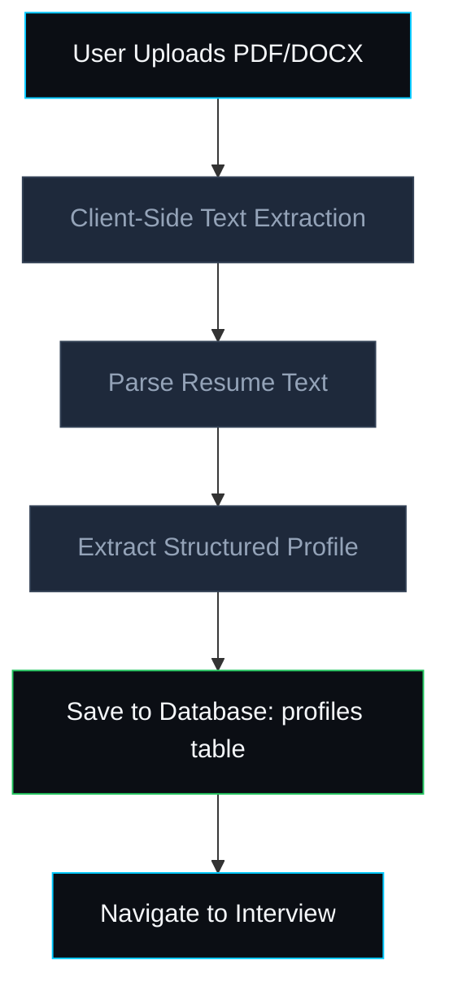
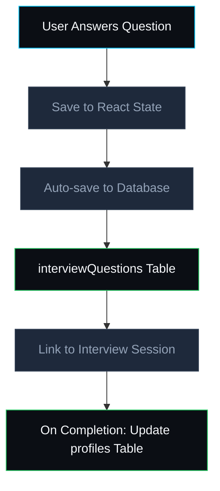
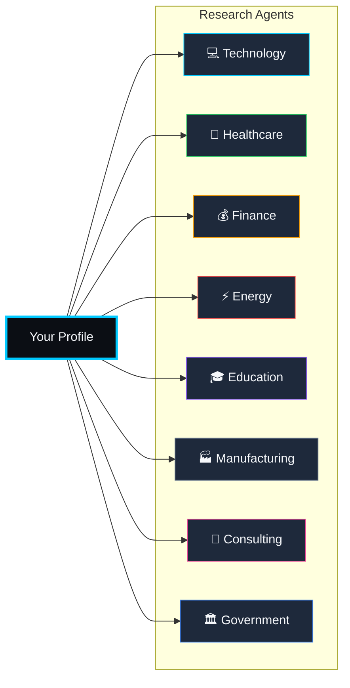
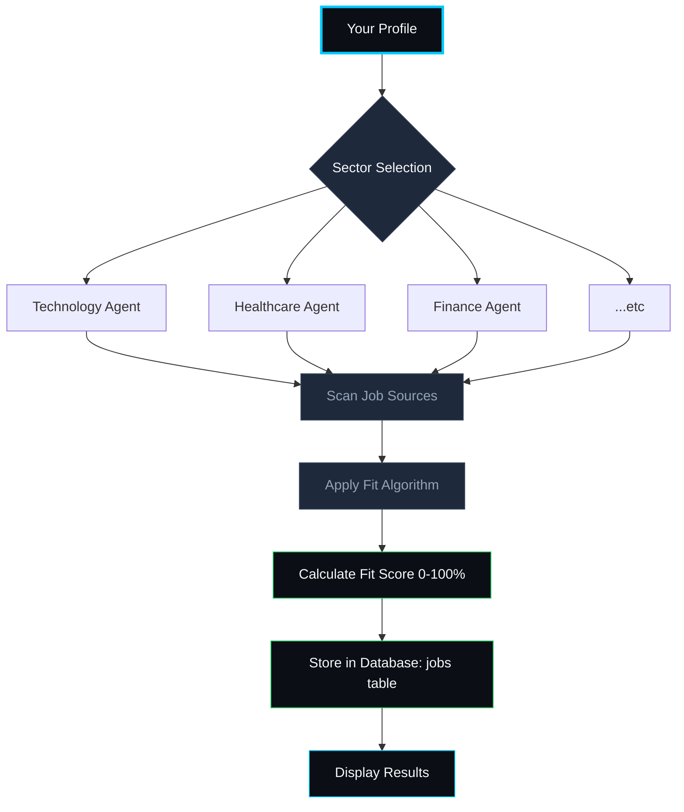
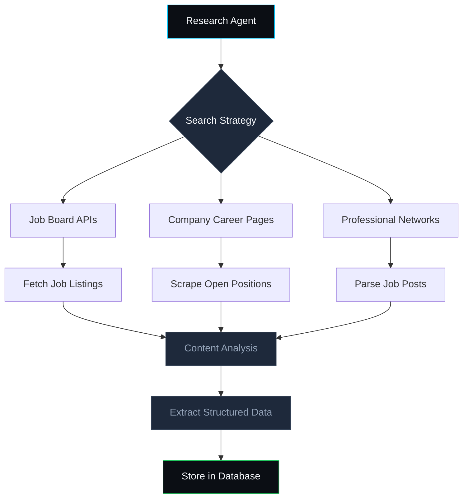
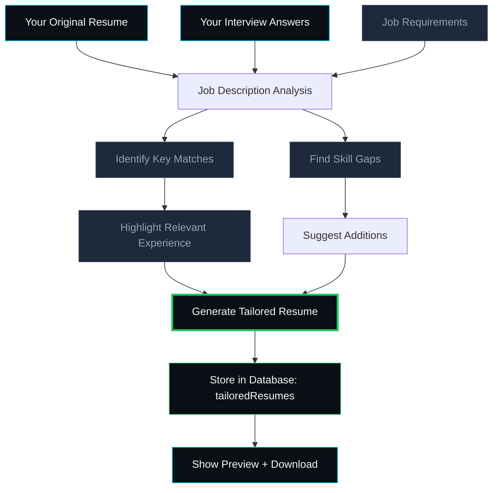

# How CareerSync AI Works

## Overview

CareerSync AI is a full-stack application that helps job seekers find and apply to relevant positions by combining AI-powered resume analysis, intelligent job matching, and automated resume tailoring. This document explains exactly how your information flows through the system and how AI is used at each step.

---

## The Five-Step Journey


---

## Step 1: Resume Upload & Parsing

When you upload your resume (PDF or DOCX), the system extracts your professional profile:

### What Gets Extracted

| Field           | Source                              | How It's Used                                             |
| --------------- | ----------------------------------- | --------------------------------------------------------- |
| **Full Name**   | Resume header                       | Profile identification, tailored resume header            |
| **Skills**      | Skills section + experience bullets | Job matching algorithm, keyword optimization              |
| **Education**   | Education section                   | Qualification filtering, role-level matching              |
| **Experience**  | Work history                        | Fit score calculation, resume tailoring context           |
| **Resume Text** | Full document                       | AI analysis, semantic matching, tailoring source material |

### Data Flow



**Database Storage:** Your parsed resume is stored in the `profiles` table with fields including:

- `fullName`, `skills`, `education`, `experience`
- `resumeText` (the full extracted text)
- `resumeUrl` (original filename)
- `status` (tracks progress: "uploaded" → "interviewing" → "completed")

---

## Step 2: AI Interview

After uploading your resume, CareerSync AI conducts a structured interview to understand your career goals and preferences. This information is **combined with your resume data** to create a complete candidate profile.

### The 8 Interview Questions

| #   | Question                          | Category               | Answer Type   | Stored In                                       |
| --- | --------------------------------- | ---------------------- | ------------- | ----------------------------------------------- |
| 1   | Career goals (short & long term)  | `career-goals`         | Free text     | `interviewQuestions` table + `profiles.summary` |
| 2   | Target roles                      | `preferred-roles`      | Multi-select  | `profiles.preferredRoles`                       |
| 3   | Key skills to use                 | `skills`               | Multi-select  | `profiles.skills` (merged with resume)          |
| 4   | Preferred industries              | `preferred-industries` | Multi-select  | `profiles.preferredIndustries`                  |
| 5   | Desired location                  | `location`             | Text input    | `profiles.targetLocation`                       |
| 6   | Work environment preference       | `work-type`            | Single-select | `profiles.workType`                             |
| 7   | Compensation priority (1-5 scale) | `salary`               | Scale         | `profiles.salaryExpectation`                    |
| 8   | Experience level target           | `experience-level`     | Single-select | Used for job filtering                          |

### How Interview Answers Are Stored



**Database Tables:**

- `interviews` — tracks the interview session (status, progress, completion)
- `interviewQuestions` — stores each question and your answer with timestamps
- `profiles` — aggregated data from both resume + interview (updated on completion)

### Your Profile Sidebar (Live Preview)

As you answer questions, a live profile card builds up showing:

```
┌─────────────────────────────┐
│  👤 Your Profile              │
│  ━━━━━━━━━━━━━━━━━━━━━━━━━  │
│  🧭 Career Goals              │
│     "I want to work in..."    │
│  💼 Target Roles              │
│     [Software Engineer] [Data]│
│  ⚡ Skills                    │
│     [Python] [React] [AWS]    │
│  🏭 Sectors                   │
│     [Technology] [Finance]    │
│  📍 Desired Location          │
│     San Francisco, CA         │
│  🏢 Work Environment          │
│     Fast-paced startup        │
│  💰 Compensation Priority     │
│     3 / 5 — Medium            │
│  🎯 Experience Level          │
│     Senior                    │
└─────────────────────────────┘
```

---

## Step 3: Research Agents (Job Discovery)

This is where CareerSync AI searches for jobs matching your profile. The system uses **specialized AI agents** that each focus on a different economic sector.

### The 8 Sector Agents



### How Job Matching Works



### Fit Score Calculation

The fit score (0-100%) is calculated based on:

| Factor                | Weight | How It's Computed                                     |
| --------------------- | ------ | ----------------------------------------------------- |
| **Skills Match**      | ~35%   | Overlap between your skills and job requirements      |
| **Experience Level**  | ~25%   | Alignment between your target level and job seniority |
| **Sector Preference** | ~20%   | Match with your preferred industries                  |
| **Location**          | ~15%   | Match with your desired location (or Remote)          |
| **Work Type**         | ~5%    | Alignment with your environment preference            |

### Job Sources Scanned

The research agents scan multiple job sources:

- LinkedIn Jobs
- Indeed
- Glassdoor
- AngelList / Wellfound
- Company career pages
- Hacker News "Who is Hiring"
- Greenhouse, Lever, Workday (ATS platforms)
- ZipRecruiter

**Note:** In the current implementation, the demo uses a curated database of realistic job listings across all sectors. The production deployment can be configured to connect to live job board APIs.

### Database Storage

All discovered jobs are stored in the `jobs` table with:

- `title`, `company`, `location`, `salaryRange`
- `jobDescription`, `requirements`, `responsibilities`
- `fitScore` (calculated match percentage)
- `matchReasons` (why you match)
- `skillGaps` (areas to address)
- `sectorId` (which agent found it)
- `applicationLink` (direct application URL)

---

## AI Models & APIs Used

### Moonshot API (Kimi AI)

CareerSync AI is designed to integrate with **Moonshot AI** (Kimi's large language model API) for intelligent resume analysis and tailoring.

#### Configuration

```
Environment Variable: MOONSHOT_API_KEY
Configured in: api/lib/env.ts
Admin Panel: /admin/settings (for runtime key management)
```

#### Current Implementation Status

| Feature                    | Status            | Description                                      |
| -------------------------- | ----------------- | ------------------------------------------------ |
| Resume Text Extraction     | ✅ Active         | Client-side PDF/DOCX parsing                     |
| Structured Profile Parsing | 🟡 Template-based | Uses regex patterns + heuristics                 |
| AI-Powered Profile Parsing | 🔵 Configurable   | Moonshot API can be enabled for enhanced parsing |
| Job Discovery              | ✅ Active         | Sector-based agent simulation                    |
| Live Job Board Search      | 🔵 Configurable   | Requires API keys for job board integrations     |
| Resume Tailoring           | ✅ Active         | Template-based with sector-specific narratives   |
| AI Resume Tailoring        | 🔵 Configurable   | Moonshot API for dynamic, personalized tailoring |

#### How Moonshot API Would Be Used (Production)

When `MOONSHOT_API_KEY` is configured, the system can:

1. **Enhanced Resume Parsing**

   ```
   Input: Raw resume text
   Moonshot Prompt: "Extract structured profile: name, skills (comma-separated),
                      education summary, experience summary, key achievements"
   Output: Structured JSON for profile creation
   ```

2. **Dynamic Job Matching**

   ```
   Input: User profile + job description
   Moonshot Prompt: "Analyze fit between this candidate and job.
                      Return: fitScore (0-100), matchReasons, skillGaps"
   Output: Detailed match analysis
   ```

3. **Personalized Resume Tailoring**

   ```
   Input: Original resume + target job description
   Moonshot Prompt: "Rewrite this resume to optimize for the target job.
                      Highlight relevant experience, reorder skills,
                      add missing keywords, quantify achievements."
   Output: Fully tailored resume text
   ```

4. **Interview Question Generation**
   ```
   Input: User profile + career goals
   Moonshot Prompt: "Generate personalized interview questions
                      based on this candidate's background and goals."
   Output: Custom question set
   ```

### Internet Search & Content Fetching

The system is architected to support web-based job discovery:



**Current Implementation:** Uses curated mock job data with realistic descriptions, requirements, and salary ranges across 15 sectors and 200+ companies.

**Production Path:** The `researchMockData.ts` and `resumeMockData.ts` modules are designed to be replaced with live API integrations. The database schema (`jobs`, `tailoredResumes`) supports real data.

---

## Step 4: Results Dashboard

After research completes, you see a dashboard with all matched jobs:

### Results Display

```
┌─────────────────────────────────────────────────────┐
│  📊 47 Jobs Found Across 8 Sectors                   │
│  ━━━━━━━━━━━━━━━━━━━━━━━━━━━━━━━━━━━━━━━━━━━━━━━━━  │
│                                                      │
│  ┌─────────────────────────────────────────────┐  │
│  │ 🔵 Software Engineer at Google               │  │
│  │    📍 Mountain View, CA  |  💰 $150k-$220k  │  │
│  │    Fit Score: 94%                            │  │
│  │    [View] [Tailor Resume] [Apply]           │  │
│  └─────────────────────────────────────────────┘  │
│                                                      │
│  ┌─────────────────────────────────────────────┐  │
│  │ 🟢 Data Scientist at Netflix                 │  │
│  │    📍 Los Gatos, CA  |  💰 $160k-$240k     │  │
│  │    Fit Score: 87%                            │  │
│  │    [View] [Tailor Resume] [Apply]           │  │
│  └─────────────────────────────────────────────┘  │
│                                                      │
│  [Filter by Sector] [Sort by Fit] [Salary Range]   │
└─────────────────────────────────────────────────────┘
```

### Filtering & Sorting

- **By Sector:** Technology, Healthcare, Finance, etc.
- **By Fit Score:** 80%+ (strong match), 60-79% (good match)
- **By Salary Range:** Filter by minimum/maximum
- **By Location:** Remote, specific cities, or radius
- **By Experience Level:** Entry, Mid, Senior
- **Text Search:** Search job titles and company names

---

## Step 5: Tailored Resumes

For each job, CareerSync AI generates a **tailored version of your resume** optimized for that specific role.

### How Resume Tailoring Works



### Tailoring Changes Made

For each job, the system generates:

1. **Narrative Summary**
   - Explains how the resume was tailored for this specific role
   - Example: _"This resume has been optimized for a Software Engineer role at Google. The professional summary now opens with a focus on system architecture and technical leadership, reflecting the company's emphasis on scalable infrastructure."_

2. **Highlights** (3-4 bullet points)
   - Specific changes made to the resume
   - Example: _"Reordered skills to prioritize cloud infrastructure and distributed systems"_

3. **Changes Made** (5-8 detailed changes)
   - Detailed list of modifications
   - Examples:
     - "Summary restructured to emphasize system architecture and technical leadership"
     - "Skills section reordered: React, TypeScript, Node.js, AWS, Kubernetes prioritized"
     - "Added cloud infrastructure and DevOps achievements to experience section"
     - "Project descriptions reframed with 'scalability', 'performance', and 'reliability' keywords"

4. **Keyword Analysis**
   - **Keywords Matched:** Skills and terms from the job description that appear in your resume
   - **Keywords Missing:** Important terms not found (for your awareness)

### Sector-Specific Tailoring

Each of the 15 economic sectors has specialized tailoring templates:

| Sector                 | Tailoring Focus                                             |
| ---------------------- | ----------------------------------------------------------- |
| **Technology**         | System design, scalability, CI/CD, microservices            |
| **Healthcare**         | Clinical data, HIPAA compliance, patient outcomes           |
| **Finance**            | Risk modeling, quantitative analysis, regulatory compliance |
| **Energy**             | Renewable energy, sustainability, power systems             |
| **Education**          | Learning science, instructional design, EdTech              |
| **Manufacturing**      | Lean/Six Sigma, automation, Industry 4.0                    |
| **Consulting**         | Client impact, frameworks, executive communication          |
| **Government**         | Policy analysis, security clearance, public service         |
| **Media**              | Content strategy, audience analytics, streaming             |
| **Aerospace**          | Systems engineering, mission design, MBSE                   |
| **Pharmaceuticals**    | GMP, clinical trials, regulatory strategy                   |
| **Biotechnology**      | Gene therapy, cell culture, bioinformatics                  |
| **Automotive**         | EV technology, ADAS, functional safety                      |
| **Telecommunications** | 5G, network virtualization, cloud-native                    |
| **Retail**             | Demand forecasting, personalization, omnichannel            |

### Database Storage

Tailored resumes are stored in the `tailoredResumes` table:

- `content` — the full tailored resume text
- `highlights` — key changes made (bullet points)
- `changesMade` — detailed modification list
- `narrativeSummary` — human-readable explanation
- `jobId` — link to the target job
- `profileId` — link to your profile
- `pdfUrl` — generated PDF (when available)

---

## Complete Data Flow Architecture

```mermaid
flowchart TD
    subgraph "Frontend (React + Vite)"
        F1[UploadPage]
        F2[InterviewPage]
        F3[ResearchPage]
        F4[ResultsPage]
        F5[ResumesPage]
    end

    subgraph "Backend (Hono + tRPC)"
        B1[profile-router]
        B2[interview-router]
        B3[job-router]
        B4[resume-router]
        B5[research-router]
    end

    subgraph "Database (PostgreSQL + Drizzle)"
        D1[profiles]
        D2[interviews]
        D3[interviewQuestions]
        D4[jobs]
        D5[tailoredResumes]
        D6[researchSessions]
    end

    subgraph "AI Services"
        A1[Moonshot API]
        A2[Job Board APIs]
        A3[Email Service]
    end

    F1 -->|POST /trpc/profile.create| B1
    B1 -->|INSERT| D1

    F2 -->|POST /trpc/interview.*| B2
    B2 -->|INSERT| D2
    B2 -->|INSERT| D3

    F3 -->|POST /trpc/job.createMany| B3
    B3 -->|INSERT| D4
    B5 -->|INSERT| D6

    F4 -->|GET /trpc/job.list| B3
    B3 -->|SELECT| D4

    F5 -->|POST /trpc/resume.create| B4
    B4 -->|INSERT| D5

    A1 -.->|Optional| B1
    A1 -.->|Optional| B3
    A1 -.->|Optional| B4
    A2 -.->|Optional| B3
    A3 -.->|Optional| B1

    style F1 fill:#0B0E14,stroke:#00C9FF,color:#F5F7FA
    style F2 fill:#0B0E14,stroke:#00C9FF,color:#F5F7FA
    style F3 fill:#0B0E14,stroke:#00C9FF,color:#F5F7FA
    style F4 fill:#0B0E14,stroke:#00C9FF,color:#F5F7FA
    style F5 fill:#0B0E14,stroke:#00C9FF,color:#F5F7FA
    style B1 fill:#1E293B,stroke:#334155,color:#F5F7FA
    style B2 fill:#1E293B,stroke:#334155,color:#F5F7FA
    style B3 fill:#1E293B,stroke:#334155,color:#F5F7FA
    style B4 fill:#1E293B,stroke:#334155,color:#F5F7FA
    style B5 fill:#1E293B,stroke:#334155,color:#F5F7FA
    style D1 fill:#0B0E14,stroke:#22C55E,color:#F5F7FA
    style D2 fill:#0B0E14,stroke:#22C55E,color:#F5F7FA
    style D3 fill:#0B0E14,stroke:#22C55E,color:#F5F7FA
    style D4 fill:#0B0E14,stroke:#22C55E,color:#F5F7FA
    style D5 fill:#0B0E14,stroke:#22C55E,color:#F5F7FA
    style D6 fill:#0B0E14,stroke:#22C55E,color:#F5F7FA
    style A1 fill:#111827,stroke:#F59E0B,color:#F5F7FA
    style A2 fill:#111827,stroke:#F59E0B,color:#F5F7FA
    style A3 fill:#111827,stroke:#F59E0B,color:#F5F7FA
```



---

## Technology Stack

| Layer          | Technology               | Purpose                                             |
| -------------- | ------------------------ | --------------------------------------------------- |
| **Frontend**   | React 18 + TypeScript    | UI components, state management                     |
| **Styling**    | Tailwind CSS + shadcn/ui | Responsive, dark-themed design                      |
| **Animations** | Framer Motion            | Page transitions, interactive effects               |
| **Build Tool** | Vite                     | Fast development, optimized production builds       |
| **Backend**    | Hono (Node.js)           | Lightweight, fast HTTP framework                    |
| **API**        | tRPC + Zod               | Type-safe APIs with validation                      |
| **Database**   | PostgreSQL (Supabase)    | Relational data storage                             |
| **ORM**        | Drizzle                  | Type-safe database queries                          |
| **Auth**       | JWT + bcrypt             | Secure session management                           |
| **Email**      | Resend API               | Transactional emails (verification, password reset) |
| **AI**         | Moonshot API (optional)  | LLM-powered resume analysis and tailoring           |

---

## Privacy & Data Security

### What Data Is Stored

| Data Type         | Storage                  | Retention              |
| ----------------- | ------------------------ | ---------------------- |
| Resume text       | Database (encrypted)     | Until account deletion |
| Interview answers | Database                 | Until account deletion |
| Job matches       | Database                 | 90 days                |
| Tailored resumes  | Database                 | Until account deletion |
| Profile info      | Database                 | Until account deletion |
| Auth credentials  | Database (bcrypt hashed) | Until account deletion |

### What Data Is NOT Stored

- Original PDF/DOCX files (only text is extracted)
- Passwords in plain text (bcrypt hashed)
- Third-party API keys (only in environment variables)
- Payment information (handled by Stripe if enabled)

### Data Usage

Your data is used **only** for:

1. Job matching within the CareerSync AI platform
2. Resume tailoring for your job applications
3. Improving match algorithms (anonymized)

Your data is **never**:

- Sold to third parties
- Used for advertising
- Shared with employers without your consent
- Used to train external AI models

---

## Getting Started

1. **Upload your resume** at `/` (home page)
2. **Complete the AI interview** at `/interview`
3. **Launch research agents** at `/research`
4. **Review matched jobs** at `/dashboard`
5. **Download tailored resumes** at `/resumes`

For a demo of the full experience without creating an account, visit `/demo`.

---

_Built with ❤️ by CareerSync AI. Questions? Contact us through the footer links._
